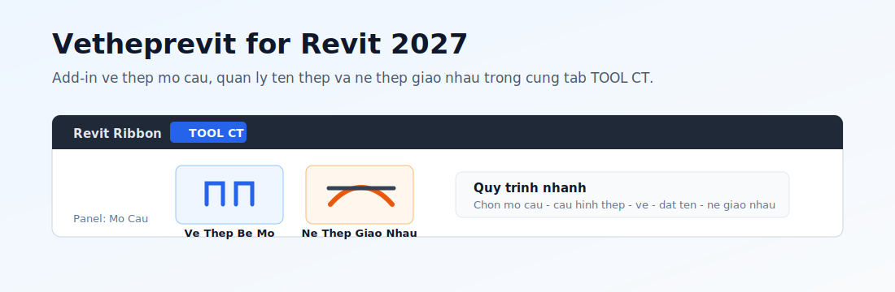
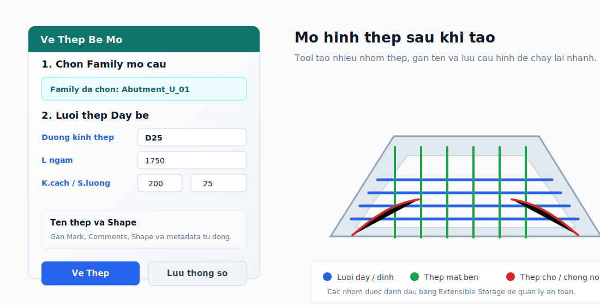
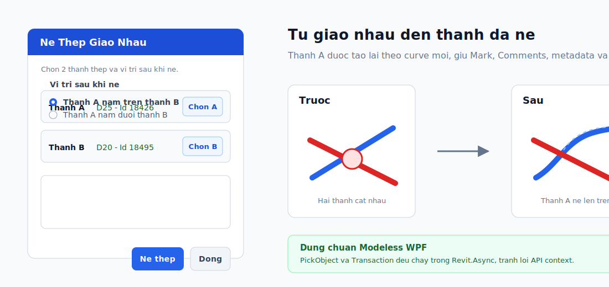

# Vetheprevit - Add-in Vẽ Thép Mố Cầu Tự Động cho Revit

**Vetheprevit** là một Add-in dành cho Autodesk Revit, được phát triển nhằm mục đích tự động hóa quá trình dựng hình cốt thép (Rebar) cho kết cấu Mố Cầu (Abutment) trong các dự án cầu đường. Công cụ giúp kỹ sư tiết kiệm thời gian, tăng độ chính xác và quản lý dễ dàng các thông số rải thép phức tạp.

## 🖼️ Hình Ảnh Trình Diễn







## 🚀 Tính Năng Chính
- ⚡ **Vẽ tự động thép bệ mố & thân mố:** Tạo nhanh các lớp thép đáy, đỉnh, thân, thép chờ, chống nứt và thép đai thông qua giao diện tham số.
- 🎨 **Giao diện trực quan:** Dễ dàng cấu hình đường kính, khoảng cách và lớp bảo vệ (Cover) với hàng trăm thiết lập chi tiết nhưng được nhóm gọn gàng.
- 🏷️ **Quản lý tên thép (BOQ):** Cửa sổ thiết lập Tên Thép riêng biệt, tự động gán nhãn cho bảng thống kê khối lượng dựa trên cơ chế Extensible Storage.
- 📐 **Công cụ "Né Thép":** Giao diện riêng để chọn thanh A cần uốn, thanh B cần né, chọn A nằm trên/dưới B rồi tự động tạo lại thanh thép đã né giao nhau.
- 🛡️ **An toàn & Toàn vẹn dữ liệu:** Sử dụng `TransactionGroup` đảm bảo toàn bộ quá trình vẽ thép, gán shape, đặt tên và group thép diễn ra trọn vẹn. Nếu có lỗi, toàn bộ sẽ được Rollback và lưu Log.

## 📁 Cấu Trúc Dự Án (Clean Architecture)
Dự án được phân chia thư mục theo từng tính năng (Feature-based) để dễ dàng bảo trì và mở rộng:

- **`Features/VeThepMoCau/`** (Vẽ Thép Mố Cầu)
  - `MoCauRebarUI.xaml` & `.cs`: Giao diện chính của Add-in để cấu hình cốt thép.
  - `AbutmentRebarSettings.cs`: Các Model lưu trữ cấu hình thép (Footing, Side, Dowel, AntiBurst, Stem).
  - `CmdDrawMoCauRebar.cs`: Lệnh chính (Command) kích hoạt giao diện, xử lý vẽ thép an toàn trong TransactionGroup.
  - `MoCauRebarTool.cs`: Lõi xử lý logic hình học và gọi API của Revit để tạo hình thanh Rebar.

- **`Features/NeThep/`** (Né Thép)
  - `CmdTiltRebarEnd.cs`: Command mở giao diện Né Thép, xử lý pick Rebar và tạo lại thanh thép trong `RevitTask.RunAsync()`.
  - `TiltRebarWindow.xaml` & `.cs`: Giao diện chọn thanh A, thanh B và tùy chọn vị trí A nằm trên/dưới B.

- **`Features/TenThep/`** (Quản lý tên thép)
  - `RebarNamingWindow.xaml` & `.cs`: Giao diện cấu hình quy tắc đặt tên (Mã Mark) cho thống kê khối lượng.

- **`TienIch/`** (Tiện ích chung - Utils)
  - `Logger.cs`: Ghi lại các lỗi kỹ thuật (Exceptions) một cách âm thầm vào `%AppData%\Vetheprevit\Logs\` để phục vụ bảo trì.
  - `RebarMarkerService.cs`: Quản lý các Metadata (Extensible Storage) gán ngầm vào thép để tool nhận diện và không xóa nhầm thép thủ công.
  - `RevitElementExtensions.cs`: Cung cấp các extension nội bộ `.ToElement<T>()` và `.FindParameter()` để giữ phong cách code fluent theo chuẩn dự án mà không cần nạp DLL `Nice3point.Revit.Extensions` khi test bằng AddIn Manager.

## ⚙️ Cách Cài Đặt & Sử Dụng
1. **Biên dịch (Build):** Project hiện target `net10.0-windows` cho Revit 2027. Đảm bảo đã tham chiếu đúng `RevitAPI.dll` và `RevitAPIUI.dll` trong thư mục cài Revit 2027, sau đó chạy:
   ```powershell
   dotnet clean
   dotnet build
   ```
2. **Cài đặt:** 
   - Khi test bằng AddIn Manager, đóng hẳn Revit nếu vừa thêm/gỡ dependency hoặc vừa rebuild lớn, sau đó load lại file `bin\Debug\net10.0-windows\Vetheprevit.dll`.
   - Hoặc tạo file `.addin` đặt vào thư mục `%appdata%\Autodesk\Revit\Addins\[Phiên_Bản]` để Add-in tự động khởi động cùng Revit.
3. **Sử dụng:**
   - Mở Revit, chuyển sang Tab **TOOL CT**, Panel **Mố Cầu**.
   - Bấm **Vẽ Thép Bệ Mố** để mở bảng cấu hình rải thép cho mố cầu.
   - Bấm **Né Thép Giao Nhau** để mở giao diện riêng:
     - **Chọn A:** thanh thép cần uốn nghiêng một đầu.
     - **Chọn B:** thanh thép cần né.
     - Chọn **Thanh A nằm trên thanh B** hoặc **Thanh A nằm dưới thanh B**.
     - Bấm **Né thép** để tạo lại thanh A theo vị trí đã chọn.

## 🖥️ Yêu Cầu Hệ Thống
- Autodesk Revit 2027.
- Windows OS có runtime .NET tương thích với Revit 2027.

## 📝 Ghi Chú Kỹ Thuật
- **Revit.Async:** UI WPF modeless gọi Revit API thông qua `Revit.Async.RevitTask.RunAsync()`. Không dùng `ExternalEvent.Create()` thủ công cho các action từ UI.
- **Giao diện Né Thép:** `TiltRebarWindow` chỉ giữ trạng thái chọn và phát lệnh. Mọi thao tác Revit API như `PickObject`, đọc `Rebar`, tạo thanh mới và xóa thanh cũ đều được bọc trong callback `RevitTask.RunAsync()` tại `CmdTiltRebarEnd.cs`.
- **Fluent Element/Parameter API:** Code vẫn dùng `.ToElement<T>()` và `.FindParameter()` theo chuẩn `AI_CODING_SKILLS.md`. Hiện tại hai extension này được triển khai nội bộ trong `TienIch/RevitElementExtensions.cs`.
- **Nice3point.Revit.Extensions:** Không khai báo NuGet `Nice3point.Revit.Extensions` trong `Vetheprevit.csproj` ở giai đoạn test bằng AddIn Manager, vì AddIn Manager dễ lỗi load/cached dependency khi hot reload DLL phụ. Nếu sau này chuyển sang phát hành bằng `.addin`/installer ổn định và cần thêm nhiều helper nâng cao của Nice3point, có thể cân nhắc đưa package thật vào lại và phân phối DLL phụ cùng add-in.
- **Output hiện tại:** Sau build, thư mục `bin\Debug\net10.0-windows\` chỉ cần các file chính như `Vetheprevit.dll`, `Revit.Async.dll`, `Vetheprevit.deps.json` và `.pdb` khi debug. Không cần `Nice3point.Revit.Extensions.dll`.
- **Extensible Storage:** Dự án sử dụng Extensible Storage của Revit để ghi nhớ các thiết lập vẽ thép trước đó, giúp kỹ sư không phải nhập lại từ đầu trong lần chạy sau. Đồng thời nó giúp tool "đánh dấu chủ quyền" các thanh thép do nó vẽ ra.
- **Error Tracking:** Mọi sự cố kỹ thuật sẽ được tự động log tại `AppData\Roaming\Vetheprevit\Logs`.
